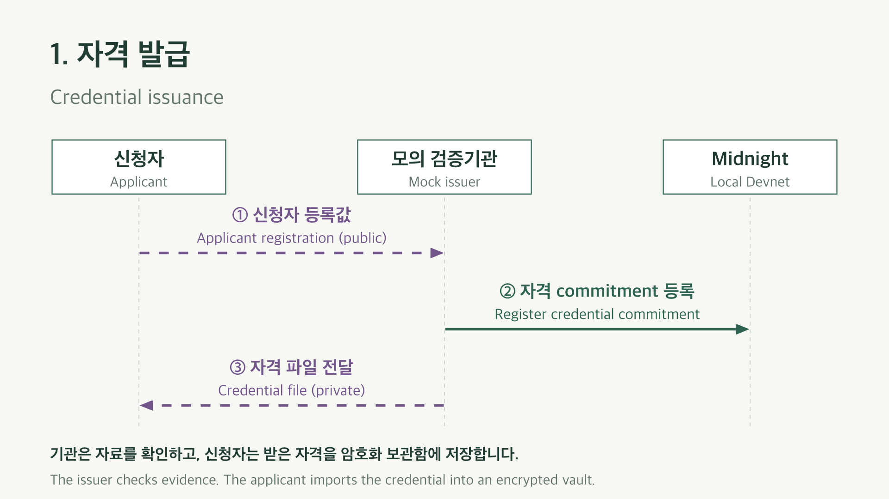
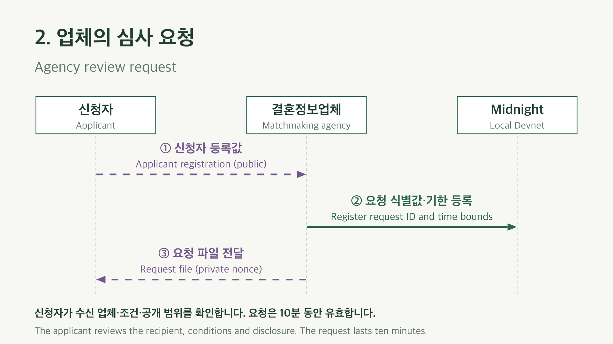
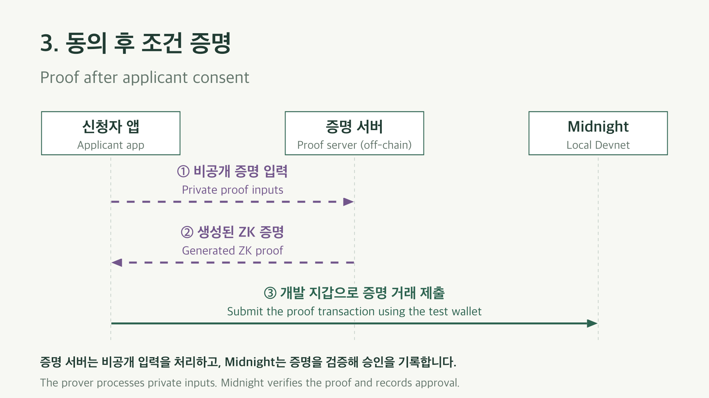

# MatchProof architecture

MatchProof checks marriage-agency eligibility using synthetic evidence on Midnight Local Devnet (`undeployed`). The issuer checks the evidence, the applicant consents to a proof, and the agency reads the confirmed result.

## Components and trust boundaries

| Component | Responsibility | Data it handles |
| --- | --- | --- |
| Mock issuer | Issue credentials after checking synthetic evidence | Exact evidence, applicant registration value, issuer secret |
| Applicant browser | Store the credential, review disclosure and submit a proof | Credential, applicant secret, request nonce and local consent |
| Agency browser | Register requests and read approvals | Applicant registration value, local reference, request nonce, agency secret and public results |
| Proof server, off-chain | Generate the zero-knowledge proof | Private proof inputs |
| Midnight contract, on-chain | Verify proof-bearing transactions and maintain public state | Policy, commitments, request time bounds and approvals |
| Indexer, off-chain | Follow and serve public chain state | Public contract state |

The agency does not receive the applicant credential or exact income. The issuer and applicant know the evidence, and the proof server processes private inputs. A loopback endpoint can be an SSH forward to another machine. The browser relies on the configured indexer and does not independently authenticate its responses using chain headers and inclusion proofs.

## Credential issuance

The applicant shares a public registration value derived from an applicant secret. The issuer's `issue` circuit checks the issuer secret against `issuerKeyHash`, commits to the credential and deployment's `programId`, and inserts the commitment into `credentials` and `registered`. The Merkle tree has capacity for 1,024 credentials.

The credential contains the holder commitment, a random salt, exact synthetic income, income year, marital-status flag, evidence check time and validity deadline. Only the commitment becomes a public ledger entry. After confirmation, the issuer delivers the credential JSON to the applicant. Import checks bind it to the applicant key and registered commitment.

## Agency request

`openRequest` checks the agency secret. A public request identifier commits to the deployment's `programId`, applicant registration value and private request nonce. The contract records `requestedAt` and `expiresAt`, checks block-time bounds and permits a request window of at most 600 seconds. The application uses ten-minute requests.

The agency keeps the correspondence between its synthetic reference and the public request ID in its encrypted browser state. It sends the request JSON, including the nonce, to the applicant. The reference is not a real member-authentication system.

## Consent and proof

Explicit consent is an application requirement before proof submission. The `proveEligibility` circuit checks:

- the credential's Merkle membership and holder-secret ownership;
- the request binding to this program, applicant and nonce;
- the configured income year and minimum income;
- not being married on the evidence check date;
- evidence checked no later than the request start and valid/fresh through the request deadline;
- block-time validity and absence of an earlier approval for the same request.

The demonstration policy is 2025 income of at least KRW 50 million and evidence no older than seven days through the request deadline. The circuit writes `approvals[requestId] = expiresAt` only when all checks pass. The app displays success after `callTx` returns a confirmed transaction.

The official test-wallet adapter used by `npm run demo` signs development transactions automatically. It does not display a wallet extension's approval prompt. JSON files are a manual prototype delivery mechanism, not a production credential transport.

## Public result

The agency or judge queries the same deployment through the indexer without applicant files or a connected wallet. No successful approval appears for a failed proof. The agency's Pending status does not distinguish an unprocessed request from an unsuccessful attempt.

Public state includes `programId`, issuer and agency key hashes, policy values, credential commitments and Merkle state, request identifiers and time bounds, and approvals. Transaction metadata is also observable. Private witness values are not public ledger fields. An approval can reveal policy satisfaction if the request is linked to a person.

## Expiry and limitations

Expiry prevents a new proof for that request and changes the UI to Expired. It does not delete historical requests or approvals. The contract has no deletion or immediate-revocation circuit.

Real-document truth depends on the issuer. The prototype does not integrate government records, real member authentication, person-uniqueness checks or vault-loss recovery. It does not prove current marital status after the check date, complete anonymity or automatic compliance with privacy law.

## Implementation

- [Compact contract](../contracts/matchproof.compact)
- [Client and provider integration](../src/matchproof/client.ts)
- [Private-state model and file validation](../src/matchproof/model.ts)
- [Development services](../infra/compose.yml)
- [Validation and reproducible checks](validation.md)

Dashed arrows in the diagrams are off-chain transfers, including both public registration values and private files. Green arrows are chain transactions; blue arrows are public reads. The diagrams omit setup, fees and detailed signing order.
