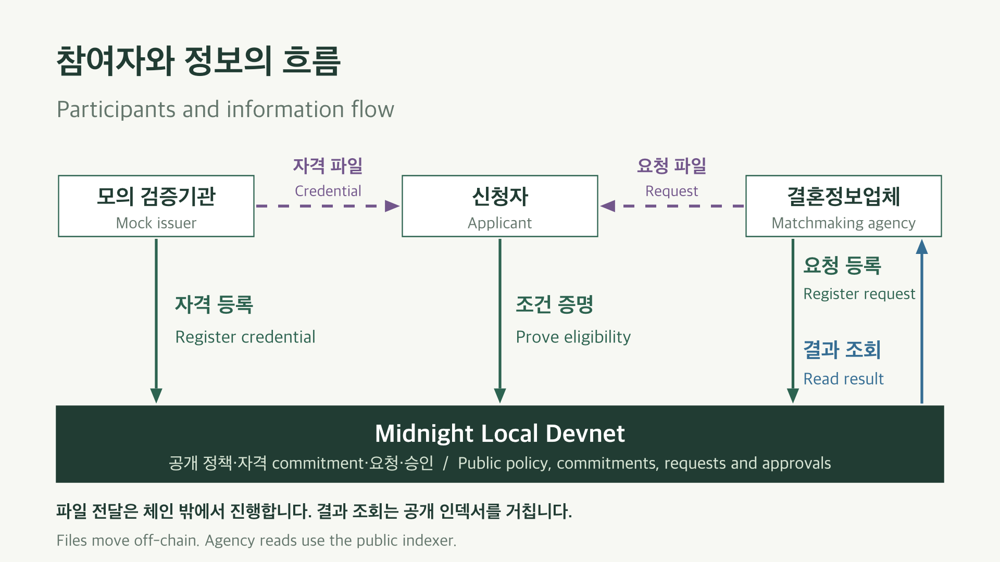
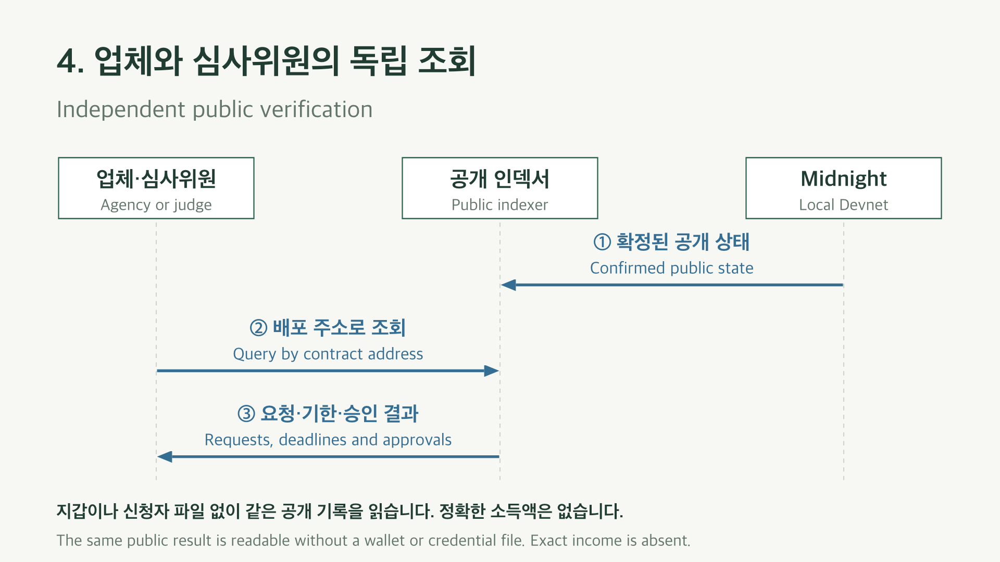

# MatchProof 발표 자료 / Presentation notes

[11장 PowerPoint](MatchProof-pitch.ko-en.pptx)에는 한국어와 영어 핵심 문장을 함께 넣었다. 전체 흐름 1장과 단계별 교환 그림 4장을 추가했다. 도형·화살표·글자를 PowerPoint에서 수정할 수 있다. [영상용 그림 PNG](diagrams/README.md)와 [촬영 가이드](recording-guide.md)도 제공한다. 아래 내용은 발표자 노트다. 실제 화면 조작과 영어 자막은 [영상 대본](demo-script.md)을 따른다.

팀 현재: [pegeaether](https://github.com/pegeaether), [mjlee5929](https://github.com/mjlee5929).

## 1. MatchProof

**한국어:** 결혼정보업체를 위한 비공개 가입 조건 검증

**English:** Private eligibility checks for marriage matchmaking agencies

발표: “업체는 가입 조건을 확인하려고 상세 서류까지 보관하는 경우가 있습니다. MatchProof는 신청자가 발급받은 자격으로 조건을 증명하고, 업체가 확정 결과를 조회하는 흐름을 구현했습니다. 가상 자료와 Midnight Local Devnet으로 시연합니다.”

## 2. 참여자와 정보의 흐름 / Participants and information flow

발표: “검증기관은 신청자에게 자격 파일을 주고, 체인에는 자격의 commitment를 등록합니다. 업체는 심사 요청을 등록한 뒤 신청자에게 요청 파일을 줍니다. 신청자가 조건을 증명하면 업체는 공개 인덱서로 확정 결과를 조회합니다.”

그림의 점선은 체인 밖의 전달, 초록 실선은 체인 거래, 파랑 실선은 공개 조회다. 점선에는 공개 등록값의 전달도 있으므로 모든 점선 데이터를 비공개라고 부르지 않는다. 아래 단계는 같은 배포에 연결한 상태부터 시작한다. 업체 등록값 전달·계약 배포와 SDK 내부 수수료 처리 등은 생략했다.

## 3. 데모 심사 조건 / Demo eligibility policy

- **소득:** 2025년 연간 5,000만 원 이상 / 2025 annual income of at least KRW 50 million.
- **혼인 상태:** 확인 기준일에 혼인 중이 아님 / Not married on the evidence check date.
- **최신성:** 요청 종료까지 확인 후 7일 이내 / Evidence no older than seven days through the request deadline.

발표: “이 기준은 가상 데모 정책입니다. 정확한 소득은 예를 들어 6,500만 원이지만, 업체가 확인할 조건은 5,000만 원 이상인지입니다. 혼인 상태는 확인 기준일의 상태이며, 과거 혼인 이력이 없다는 의미가 아닙니다.”

## 4. 자격 발급 / Credential issuance

1. 신청자가 기관에 공개 등록값을 준다. 신청자의 비밀키를 보내는 것이 아니다.
2. 모의 기관이 가상 자료를 확인하고 신청자 키에 묶인 자격 commitment를 체인에 등록한다.
3. 확정 후 기관이 해당 신청자에게만 자격 파일을 준다. 신청자가 암호화 보관함에 가져온다.

발표: “체인에는 commitment가 남고, 상세 가상 자료를 담은 자격 파일은 신청자가 받습니다. 업체가 자격 파일을 받는 단계는 없습니다.”

English: The applicant shares a public registration value. The issuer registers a credential commitment, then sends the private credential to that applicant after confirmation.

## 5. 업체의 심사 요청 / Agency review request

1. 신청자가 업체에 공개 등록값을 준다.
2. 업체가 배포·신청자·난수에 결합한 요청 식별값과 시간 범위를 체인에 등록한다.
3. 확정 후 업체가 private nonce를 포함한 요청 파일을 신청자에게 준다.

발표: “업체가 받는 것은 신청자 등록값입니다. 업체는 심사 요청을 만들고 신청자에게 전달합니다. 신청자는 이미 배포된 공개 정책과 수신자·기한·공개 범위를 확인합니다.”

English: The agency registers a request ID and time bounds. The applicant receives a request file containing the private nonce. The agency does not receive the applicant credential.

## 6. 동의 후 조건 증명 / Proof after applicant consent

1. 신청자 앱이 동의 후 비공개 증명 입력을 증명 서버에 전달한다.
2. 체인 밖의 증명 서버가 만든 ZK 증명을 앱에 반환한다.
3. 앱이 개발 지갑을 사용해 증명 거래를 제출한다. Midnight가 검증하고 확정한 뒤 성공으로 표시한다.

발표: “증명 서버는 비공개 입력을 처리합니다. 실제 SDK의 수수료·서명 세부 순서는 생략했지만, 비공개 입력과 체인에 제출하는 증명을 구분해서 보여드립니다. 테스트 지갑은 자동 서명합니다.”

English: The off-chain prover processes private inputs and returns a ZK proof. The application uses the test wallet to submit a proof-bearing transaction. Midnight verifies it and records approval. Loopback addresses may forward to another machine.

## 7. 업체와 심사위원의 독립 조회 / Independent public verification

1. 인덱서는 확정된 공개 체인 상태를 조회할 수 있게 제공한다.
2. 업체 또는 심사위원이 배포 주소로 인덱서를 조회한다.
3. 같은 공개 요청 식별값·기한·승인 기록을 읽는다. 신청자 파일이나 지갑 연결은 필요하지 않다.

발표: “업체가 성공 여부를 임의로 만드는 구조가 아닙니다. 신청자의 자료 없이 같은 체인 기록을 읽습니다. 요청의 공개 식별값과 배포 주소를 비교하면 같은 결과인지 확인할 수 있습니다.”

English: The agency or judge queries the public indexer by contract address and reads the same confirmed request and approval. This public read needs neither a connected wallet nor an applicant credential. The diagram describes data flow, not a specific chain-to-indexer push API.

## 8. 신청자 동의 / Applicant consent

**한국어:** 자격과 요청을 가져온 뒤 수신자·조건·기한·공개 결과를 확인합니다.

**English:** The applicant imports the credential and request, then reviews the recipient, conditions, deadline and public result.

발표: “모의 기관이 신청자 키에 묶인 자격을 발급합니다. 업체가 요청을 만들면 신청자가 자격과 요청을 가져옵니다. 두 파일과 유효한 요청이 있어야 하며, 동의도 필요합니다. 버튼 활성화만으로 체인 성공을 뜻하지는 않습니다.”

자료: 사용자가 제공한 동의 화면 캡처. 버튼이 비활성인 과거 화면으로, 성공 거래 증거가 아니다. 실시간 시연에서는 자격 가져오기와 새 요청 준비 후 진행한다.

## 9. 비공개 입력과 공개 기록 / Private inputs and public records

**비공개 입력 / Private inputs:** 정확한 소득, 확인 기준일 상태, 자격 세부 값과 비밀키.

**공개 기록 / Public records:** commitment, 정책, 요청 식별값, 시각·기한, 승인 기록.

발표: “Compact 회로가 자격의 등록 여부, 신청자 키 소유와 정책 충족을 검증합니다. 업체는 원본과 정확한 소득 없이 공개 인덱서에서 확정 결과를 읽습니다. 기관과 신청자는 자료를 알고, 증명 서버도 비공개 입력을 처리합니다. 공개 요청이 사람과 연결되면 조건 충족 사실이 드러날 수 있습니다.”

## 10. 10분 요청과 남는 기록 / Request expiry and retained history

**한국어:** 만료 후 새 증명을 제한하며, 과거 공개 기록은 유지합니다.

**English:** Expiry blocks a new proof for that request. Historical public records remain.

발표: “요청은 10분 동안 유효합니다. 만료되면 과거 승인이 있어도 현재 유효한 인증으로 표시하지 않습니다. 현재 계약에는 삭제·즉시 철회 기능이 없습니다. 만료를 개인정보 파기라고 설명하지 않습니다.”

## 11. 검증 결과와 현재 범위 / Verification and scope

**확인한 결과 / Verified:** 공개 clone에서 38개 테스트·컴파일·빌드 통과. 개발 체인에서 발급·요청·증명 확정·별도 조회. 제출 전 소득 미달·재사용 거절.

**현재 범위 / Scope:** 가상 자료, 모의 기관, 자동 서명 개발 지갑. 실서류 연동·실회원 로그인은 후속 과제.

발표: “실제 개발 체인에서 확정된 증명과 별도 조회를 확인했고, 공개 clone에서도 설치와 빌드를 재현했습니다. 실패 검사는 제출 전 회로 실행에서 거절된 것으로, 실패 거래가 체인에 기록됐다는 뜻은 아닙니다. MatchProof는 업체가 보유하는 상세 정보를 줄이는 흐름을 검증합니다. 완전 익명이나 법적 의무의 자동 충족을 주장하지 않습니다.”

공개 저장소: [team-hyunjae/MatchProof](https://github.com/team-hyunjae/MatchProof).

## 짧은 질의응답 / Short answers

| 질문 / Question | 답변 / Answer |
| --- | --- |
| 체인 기록을 삭제하나요? / Does expiry delete records? | 아니요. 요청 사용을 제한하지만 기록은 남습니다. / No. Expiry limits use of the request. It retains history. |
| 누구도 원본을 보지 않나요? / Does nobody see the evidence? | 기관과 신청자는 내용을 알고 증명 서버도 비공개 입력을 처리합니다. / The issuer and applicant know it. The proof server processes private inputs. |
| 미혼임을 보증하나요? / Does this prove someone has never married? | 확인 기준일에 혼인 중이 아니라는 조건만 검증합니다. / It checks only that the person was not married on the evidence check date. |
| 실제 서류 진위를 보증하나요? / Does Midnight authenticate documents? | 발급기관의 확인을 신뢰합니다. 공공기관 연동은 없습니다. / It relies on the issuer. There is no government integration. |
| 개인정보보호법 준수가 완료됐나요? / Is compliance established? | 수집·보관할 정보의 범위를 줄이는 설계입니다. 준수 완료를 주장하지 않습니다. / The design reduces collected data. It does not establish legal compliance. |
| 별도 조회는 어떻게 하나요? / How can a judge verify it? | 같은 배포의 별도 업체 화면에서 지갑·자격 파일 없이 공개 인덱서를 조회합니다. / Read the same deployment through the separate agency view without a wallet or credential file. |

## 자료 근거 / Sources

- 정책·공개 원장·만료 검사: [Compact 계약](../contracts/matchproof.compact)
- 실행·역할별 UI: [한국어 시연 가이드](../docs/matchproof-judge-guide.md), [English demo guide](../docs/matchproof-judge-guide.en.md)
- 38개 검사와 빌드: [공개 clone 기록](evidence/2026-09-26-public-clone.json). 검사 당시 커밋을 명시한다.
- 확정 거래와 거절 검사: [9/26 개발 체인 기록](evidence/2026-09-26-matchproof-smoke.json). 과거 거래이며 현재 요청의 유효성을 보장하지 않는다.
